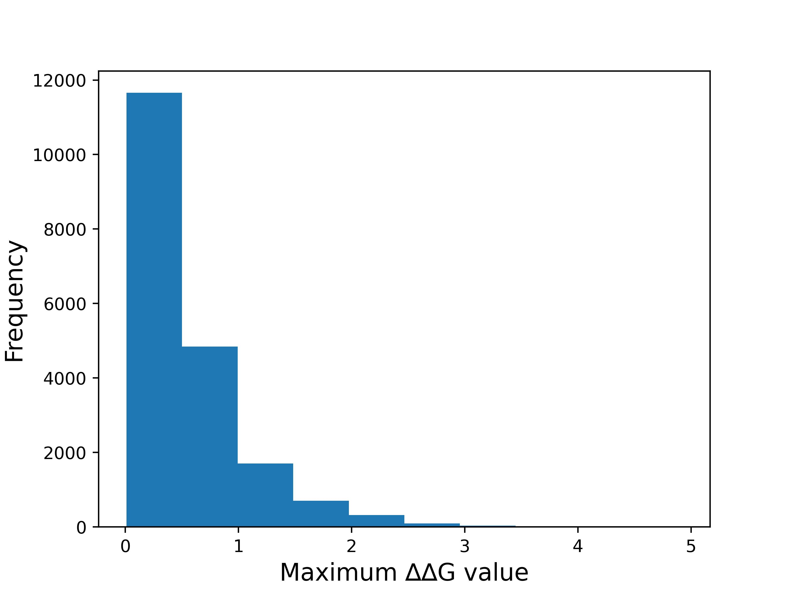
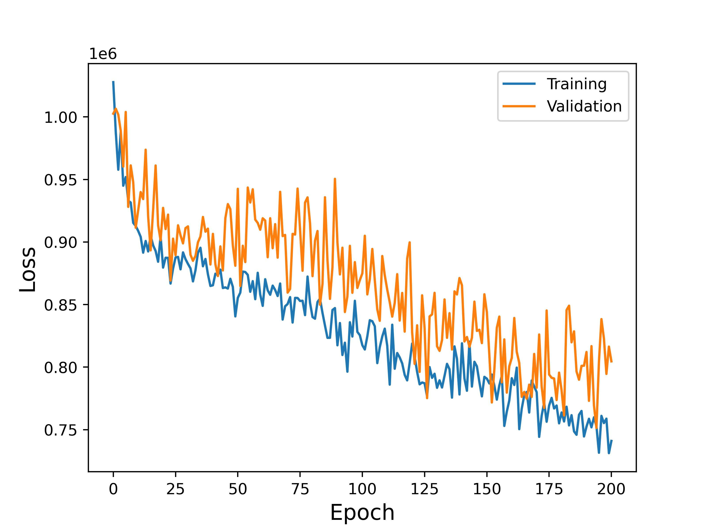
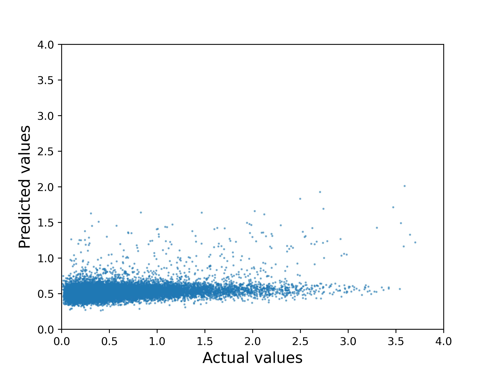
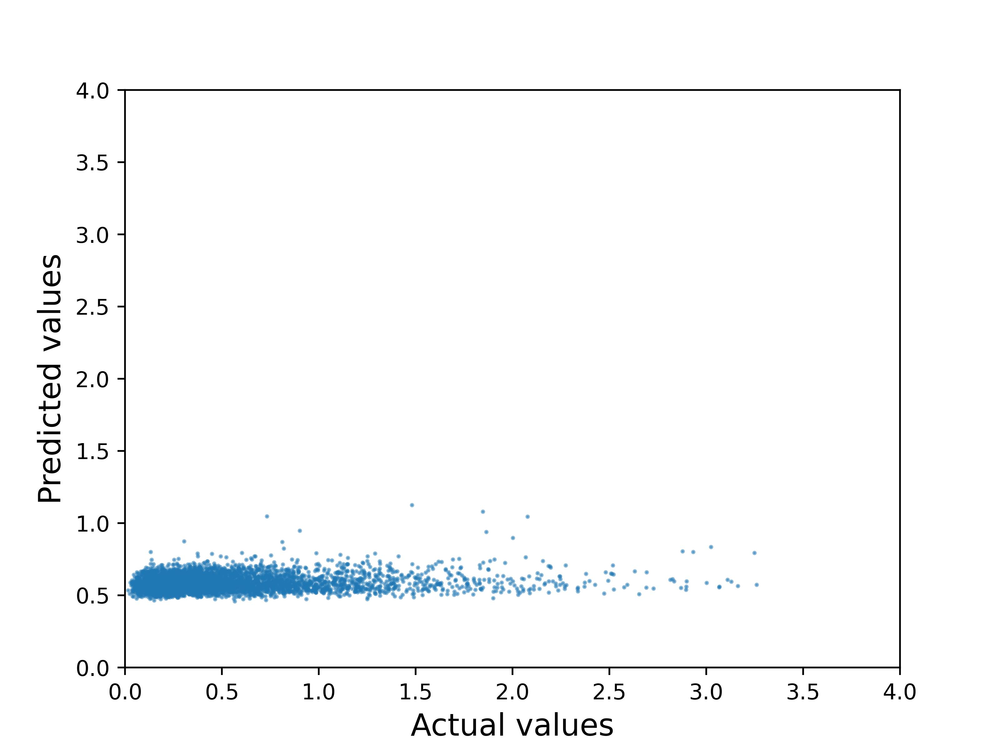

# Ensemble redistribution project

## Introduction

My project investigated the feasibility of predicting how a mutation to a protein impacts its structural ensemble when given structural data about the ensemble members. While there are models that predict stability changes based on sequence or ligands present, there is not yet a model that explicity accounts for the fact that most proteins take multiple structures. Ideally, this model would be able to predict sites at which a protein is more likely to have a mutation that redistributes its ensemble of structures, which could then lead to a change in function. 

## Dataset
For my dataset, I used 111 ensembles that I downloaded from the RCSB for my graduate research. For each ensemble, I had two structures (the two least similar structures for the protein sequence). Because my model will use a Graph Attention Neural Network, I needed to load in my data as a nodes and edges. Within a struture, each residue was a node with various features (structural coordinates, residue type, the number of different atoms present). For edges, I "created" edges between any residues where their alpha carbons were within 10å of each other. The edge attributes included the distance bewteen the two residues and whether the residues were adjacent on the sequence and therefore covalently bonded together or just nearby each other. 
What was to be predicted at each site was the maximum difference in ∆∆G value between the structures, as this value is important to whether or not ensemble redistribution occurs. 
As I trained my model, I realized a significant issue with my dataset. Because most of my maximum differences in ∆∆G values are quite low (as seen in the figure below), my model was very incentivized to predict low values. To compensate for this, I used a custom loss function that heavily weighted incorrect predictions for high actual values. 

## Training the model
To train the model, edit the train.srun file in the main directory so that the paths are correct for your local directory, then run it. This should give you an output directory with a saved model weights and some csv files containing information on the results and training process. In your train.srun file, you can choose to use the argument --use_stored_seed if you want to replicate the weights of the original_trained_model found in training_outputs. 

## Results
When I trained my model, these were the trends I observed in the loss function for my training and validation data. I implemented dropout to stop the model from overfitting, as it was very prone to it without dropout. 

While my accuracy for my train and validation data was 35% and 32% respectively, the figure below shows that my model was still mostly achieving scores such as this by predicting low values. 

When I ran my test data through my model, I got an accuracy of 31.66% and an MSE of 0.219. This accuracy isn't ideal, but the MSE isn't too large. When I graph my actual vs my predicted values for my test data, I can see that the model continues to predict low difference in maximum ∆∆G at each site. 

Clearly, my model needs a lot of improvement. This is not surprising, given how complicated the input data is. To improve this model, I would want to use a less biased dataset so my model wasn't incentivized to predict low values. I would also want to continue to explore possible loss functions that I could use to better train the model. I also would likely need to build a more complex model to better represent the structural data I was inputting. It would likely be a good idea to fine tune an existing model that already has the architecture built to comprehend protein structures. 

## License
This project is licensed under the MIT License. See  LICENSE for more details

## Acknowledgements
This project is inspired by the project [Tensorflow-Project-Template](https://github.com/MrGemy95/Tensorflow-Project-Template) by [Mahmoud Gemy](https://github.com/MrGemy95)
I also used [ThermoMPNN](https://github.com/Kuhlman-Lab/ThermoMPNN) to obtain the ∆∆G values I used as my labels. 
